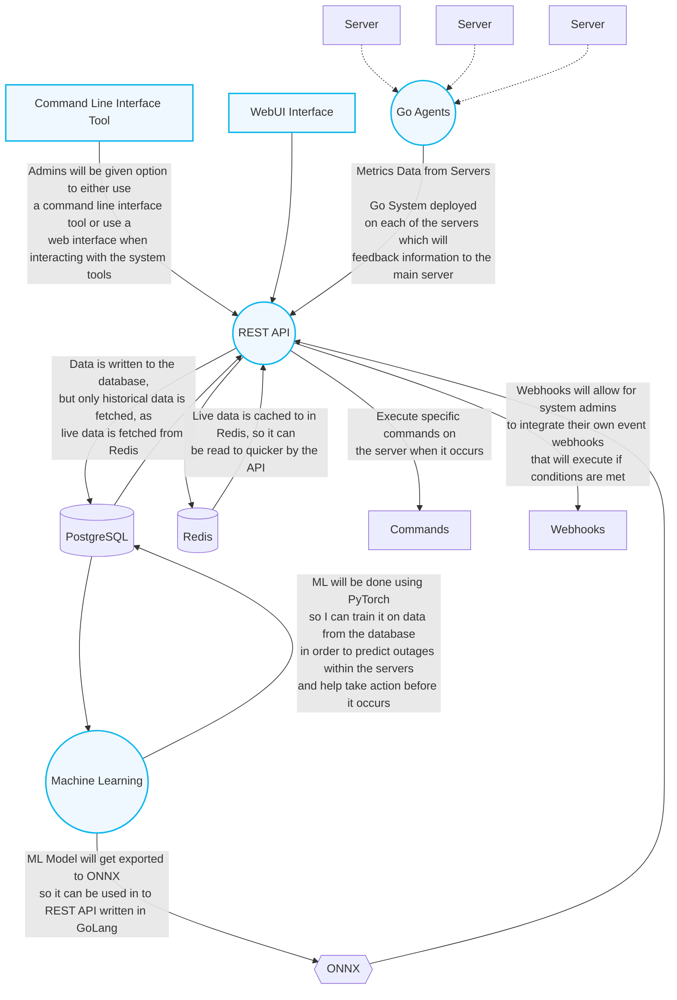
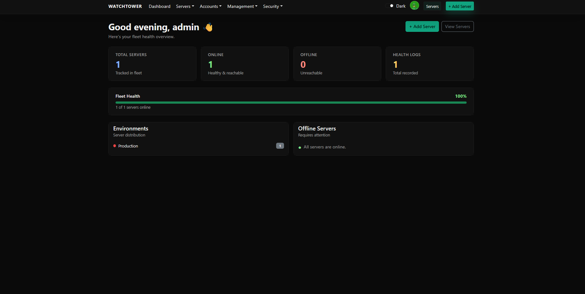
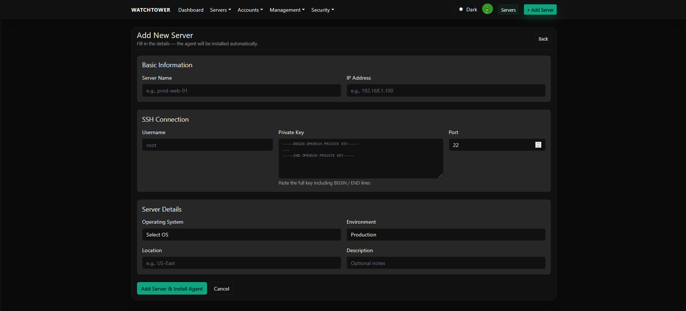
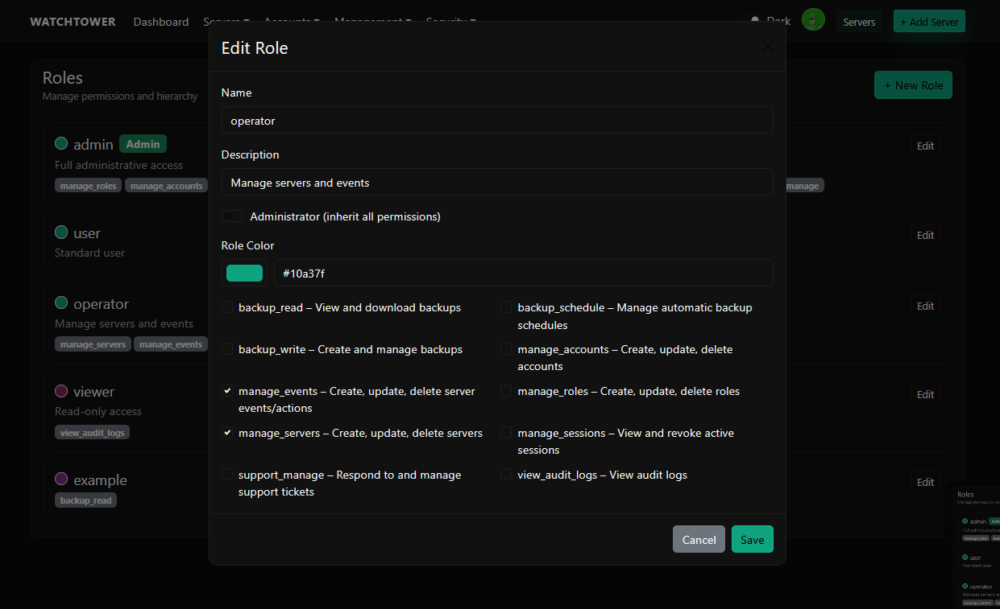
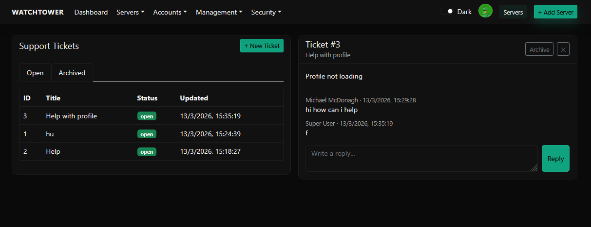
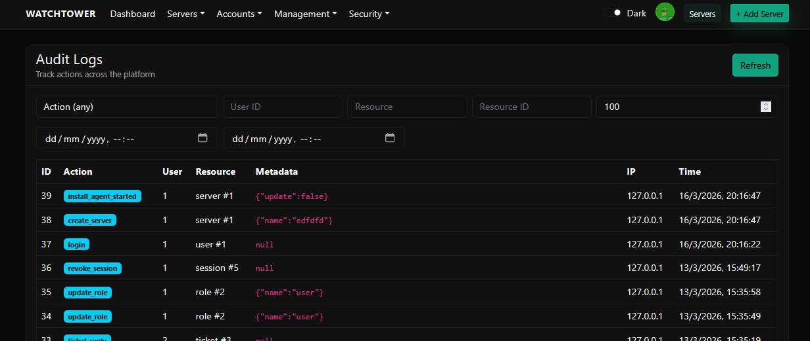
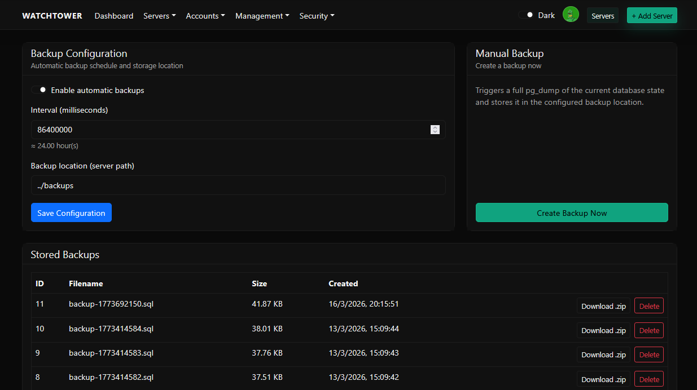
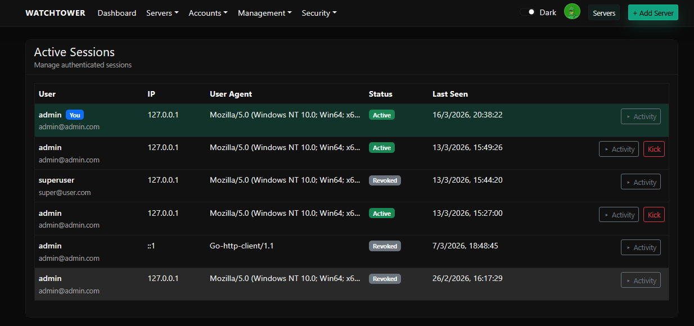
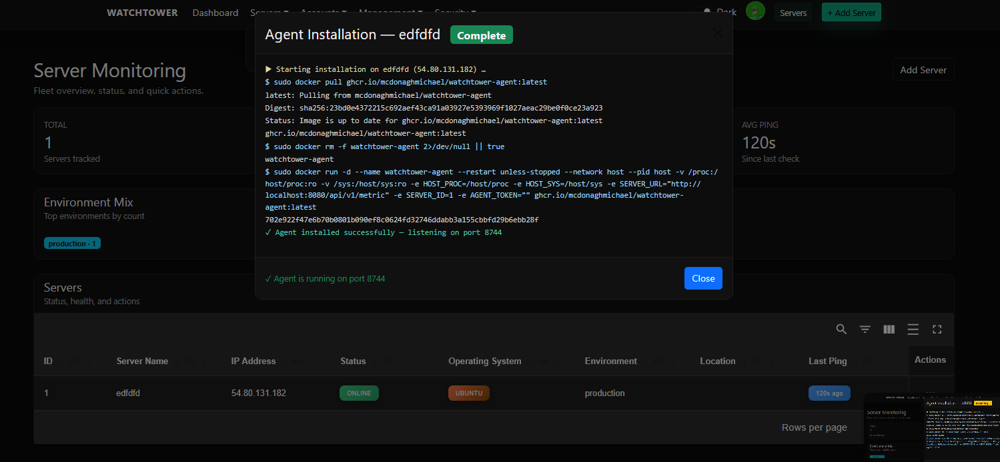
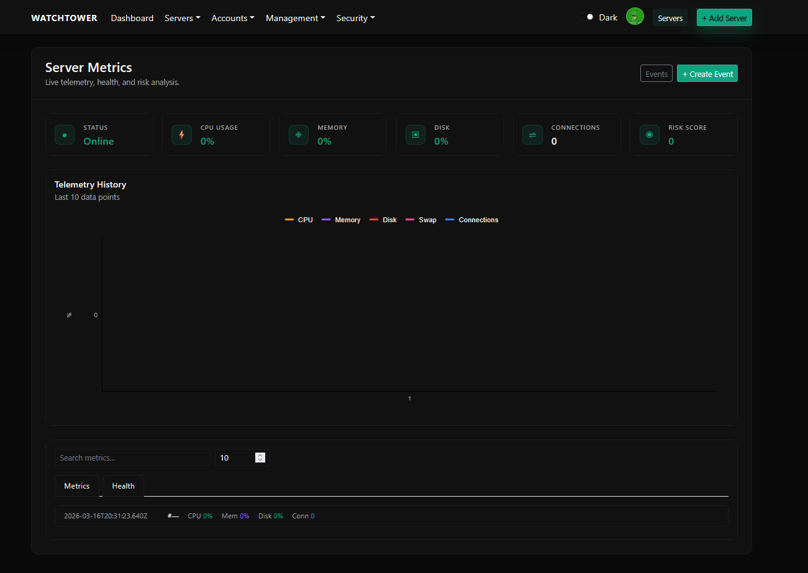

<div align="center">
  

  # Watchtower

  **Open-source infrastructure monitoring, incident management, and remote orchestration**

  [](https://go.dev/)
  [](https://react.dev/)
  [](https://www.postgresql.org/)
  [](https://redis.io/)
  [](https://www.docker.com/)
</div>

---

## Overview

**Watchtower** is a robust, production-grade platform designed to monitor, manage, and automate infrastructure across multiple servers from a single, central dashboard.

It combines:

- **Agent-based data collection** - lightweight Go binaries installed on remote servers
- **Centralised control** - ReactJS admin dashboard for full visibility and management
- **Real-time alerting & automation** - Redis + Go worker engine for instant response
- **Database-backed persistence** - PostgreSQL for storing all configuration, incidents, and logs

With Watchtower, users can deploy monitoring agents, collect system metrics, configure custom events, and manage multiple servers from a single dashboard and/or command line interface.

---

## Problem Statement

Modern companies run many servers, services, and jobs. When something goes wrong - server overload, service downtime, security event - teams need:

- Immediate detection (before users notice)
- Real-time notifications & escalation
- Automated recovery workflows
- Centralised visibility into all incidents

Existing tools like [PagerDuty](https://www.pagerduty.com/), [Datadog](https://www.datadoghq.com/), and [Ansible](https://docs.ansible.com/) are powerful but expensive and often overly complex for smaller teams.

**Watchtower** offers an open-source, lightweight alternative that combines monitoring, incident management, and remote orchestration in one platform.

---

## Architecture



| Component           | Tech Stack                  | Function                                                                 |
| ------------------- | --------------------------- | ------------------------------------------------------------------------ |
| **Admin Dashboard** | ReactJS                     | Manage servers, alert rules, view incidents, trigger deployments         |
| **Incident Engine** | Go (goroutines, channels)   | Real-time event ingestion, alert routing, auto-remediation               |
| **Database**        | PostgreSQL                  | Stores configuration, users, incidents, logs                             |
| **Cache**           | Redis                       | Event deduplication, queues, timers for escalations                      |
| **Agent**           | Go (cross-compiled binary)  | Collects metrics (CPU, memory, disk, logs) and reports to central server |

---

## Deployment Flow

1. **User adds a server** in the Admin UI
2. **Watchtower connects via SSH** to the remote host
3. **Installs the Agent binary** and registers it as a system service
4. **Agent starts collecting data** and sends JSON payloads back to Watchtower
5. **Data is processed**, stored, and matched against alerting rules
6. **If thresholds are breached** → notifications + auto-remediation trigger

---

## Features

| Feature | Description |
|---|---|
| **Multi-Server Agent Deployment** | One-click install via SSH from the central UI/CLI |
| **Real-Time Metric Collection** | CPU, memory, disk, and process monitoring |
| **Event-Based Alerting** | Execute tasks automatically when an event occurs |
| **Incident Dashboard** | View open incidents, acknowledgements, and resolution times |
| **Auto-Remediation** | Run custom scripts on affected servers automatically |
| **CLI Tool** | Trigger test incidents or manually collect metrics |

---

## Building & Pushing Docker Images

> Run these from your **local machine** (Mac/Linux). Requires Docker Desktop with buildx.

### Authenticate with GHCR

```sh
echo YOUR_GITHUB_PAT | docker login ghcr.io -u YOUR_USERNAME --password-stdin
```

> Your PAT needs scopes: `write:packages`, `read:packages`, `repo`

### Build and push all images (linux/amd64)

The server runs `linux/amd64`. If building on Apple Silicon (M1/M2/M3), you must cross-compile:

```sh
# Web UI
cd web
docker buildx build --platform linux/amd64 -t ghcr.io/mcdonaghmichael/watchtower-web:latest --push .

# API
cd ../api
docker buildx build --platform linux/amd64 -t ghcr.io/mcdonaghmichael/watchtower-api:latest --push .

# Agent
cd ../agent
docker buildx build --platform linux/amd64 -t ghcr.io/mcdonaghmichael/watchtower-agent:latest --push .
```

Or build all at once from the repo root:

```sh
for svc in web api agent; do
  docker buildx build --platform linux/amd64 \
    -t ghcr.io/mcdonaghmichael/watchtower-$svc:latest \
    --push ./$svc
done
```

---

## Deployment

> **Caution:** Watchtower is still in active development and is not ready for production. Use carefully.

### 1. Install Docker

```sh
curl -fsSL https://get.docker.com -o get-docker.sh && sudo sh get-docker.sh

# Run Docker without sudo (optional)
sudo usermod -aG docker $USER && newgrp docker
```

### 2. Authenticate with GHCR and pull images

```sh
echo YOUR_GITHUB_PAT | docker login ghcr.io -u mcdonaghmichael --password-stdin

docker pull ghcr.io/mcdonaghmichael/watchtower-api:latest
docker pull ghcr.io/mcdonaghmichael/watchtower-web:latest
docker pull ghcr.io/mcdonaghmichael/watchtower-agent:latest
```

### 3. Create Docker network

```sh
docker network create watchtower-net
```

### 4. Run PostgreSQL and Redis

```sh
docker run -d --name postgres-db --network watchtower-net \
  -e POSTGRES_DB=watchtower -e POSTGRES_USER=sysadmin -e POSTGRES_PASSWORD=password \
  -p 5432:5432 postgres:15

docker run -d --name redis-db --network watchtower-net -p 6379:6379 redis:7
```

### 5. Run the API

Replace the values below with your own. `ADMIN_EMAIL`, `ADMIN_USERNAME`, and `ADMIN_PASSWORD` create the first admin account automatically on first run.

```sh
docker run -d --name watchtower-api --network watchtower-net -p 8080:8080 \
  -e DB_HOST=postgres-db -e DB_USER=sysadmin -e DB_PASSWORD=password -e DB_NAME=watchtower \
  -e REDIS_HOST=redis-db -e REDIS_PORT=6379 \
  -e ALLOWED_ORIGIN=<YOUR_DOMAIN_OR_IP> \
  -e ADMIN_EMAIL=admin@example.com \
  -e ADMIN_USERNAME=admin \
  -e ADMIN_PASSWORD=yourpassword \
  ghcr.io/mcdonaghmichael/watchtower-api:latest
```

### 6. Run the Web UI

The web container runs on port 3000 internally so Caddy can take port 80/443.

```sh
docker run -d --name watchtower-web --network watchtower-net -p 3000:80 \
  ghcr.io/mcdonaghmichael/watchtower-web:latest
```

### 7. Set up Caddy (HTTPS + reverse proxy)

Install Caddy:

```sh
sudo apt install -y debian-keyring debian-archive-keyring apt-transport-https curl
curl -1sLf 'https://dl.cloudsmith.io/public/caddy/stable/gpg.key' | sudo gpg --dearmor -o /usr/share/keyrings/caddy-stable-archive-keyring.gpg
curl -1sLf 'https://dl.cloudsmith.io/public/caddy/stable/debian.deb.txt' | sudo tee /etc/apt/sources.list.d/caddy-stable.list
sudo apt update && sudo apt install caddy -y
```

Configure `/etc/caddy/Caddyfile`:

```
watchtower.yourdomain.com {
    reverse_proxy localhost:3000
}

api.watchtower.yourdomain.com {
    reverse_proxy localhost:8080
}

# Optional: allow access via raw IP
:80 {
    reverse_proxy localhost:3000
}
```

Start Caddy:

```sh
sudo systemctl start caddy && sudo systemctl enable caddy
```

> Caddy automatically provisions SSL certificates via Let's Encrypt once DNS is pointed at the server.
>
> **AWS note:** ensure inbound rules allow ports `80` and `443` in your EC2 security group.

### 8. Set up SSH access for remote agent installs

Watchtower SSHes into remote servers to install and manage agents. Use the included `/scripts/generate_key.sh` script on each **target/agent server** to generate a key pair:

```sh
# Download and run the script on the target server
bash generate_key.sh
```

The script will print the private and public keys, then leave the files at `/tmp/watchtower_key` and `/tmp/watchtower_key.pub`.

Authorise the public key so Watchtower can SSH in:

```sh
cat /tmp/watchtower_key.pub >> ~/.ssh/authorized_keys
chmod 600 ~/.ssh/authorized_keys

# Clean up key files when done
rm -f /tmp/watchtower_key /tmp/watchtower_key.pub
```

Then in the Watchtower UI, when adding a server, provide:
- The server's **IP address**
- **SSH username** (e.g. `ubuntu` for Ubuntu AMIs, `root` for most VPS providers)
- The **private key** (copied from the script output)

---

## Running the Agent

The agent runs on each monitored server and sends metrics back to the API. You need the **Server ID** from the Watchtower UI (shown after adding a server).

> This is only for running the Agent manually as the WebUI will allow for it to run automatically

### Via Docker (recommended for testing)

```sh
docker run -d --network host \
  -e SERVER_URL="http://<API_HOST>:8080/api/v1/metric" \
  -e SERVER_ID="<SERVER_ID>" \
  ghcr.io/mcdonaghmichael/watchtower-agent:latest
```

On a `linux/amd64` server:

```sh
docker run -d --platform linux/amd64 --network host \
  -e SERVER_URL="http://<API_HOST>:8080/api/v1/metric" \
  -e SERVER_ID=<SERVER_ID> \
  ghcr.io/mcdonaghmichael/watchtower-agent:latest
```

### Via Go (local development)

```sh
SERVER_URL="http://<API_HOST>:8080/api/v1/metric" SERVER_ID=<SERVER_ID> go run .
```

### Agent on a new AWS instance (manual setup)

1. SSH into the new instance: `ssh -i your-key.pem ubuntu@<INSTANCE_IP>`
2. Install Docker: `curl -fsSL https://get.docker.com -o get-docker.sh && sudo sh get-docker.sh`
3. Authenticate with GHCR (see above)
4. Generate the SSH key pair and authorise it (see step 8 above) - copy the private key
5. In the Watchtower UI, add the server with its IP, SSH username, and the private key
6. Watchtower will install the agent automatically via SSH, **or** run it manually:
   ```sh
   docker run -d --platform linux/amd64 --network host \
     -e SERVER_URL="http://<API_HOST>:8080/api/v1/metric" \
     -e SERVER_ID=<SERVER_ID> \
     ghcr.io/mcdonaghmichael/watchtower-agent:latest
   ```

---

## Showcase

<div align="center">
  
  
  
  
  
  
  
  
  
</div>